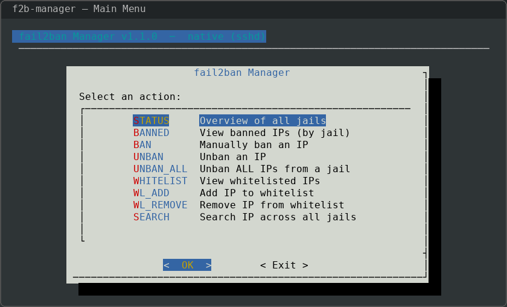
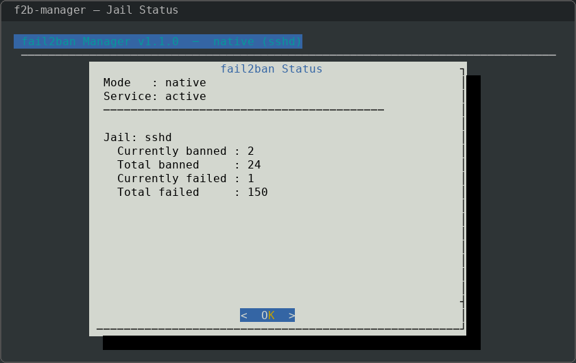
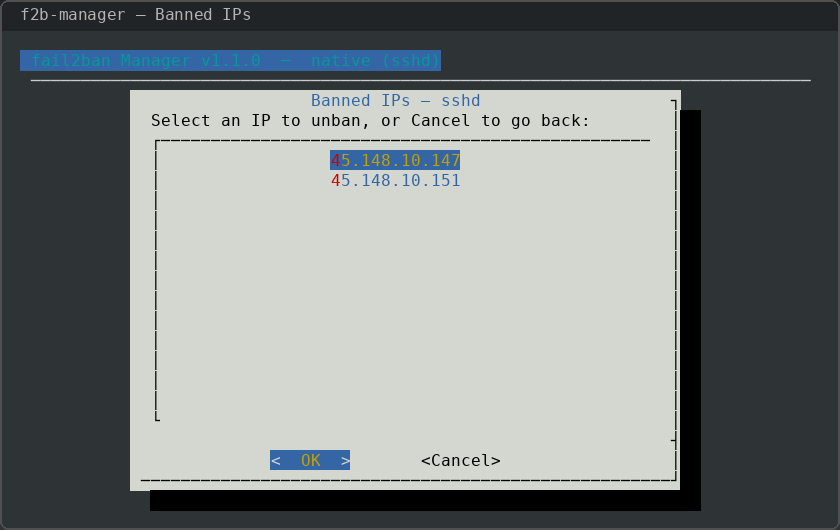
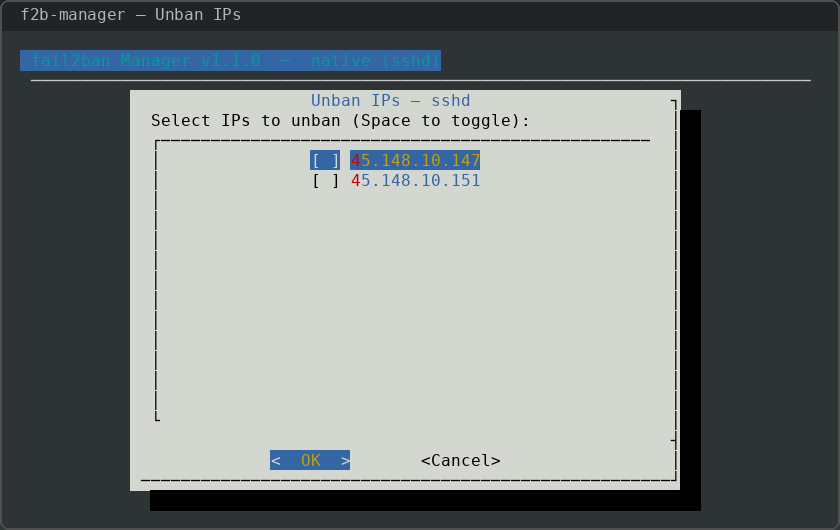
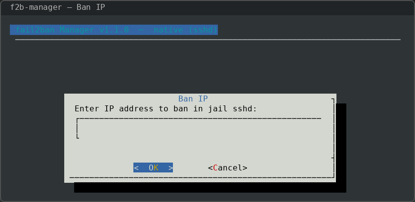
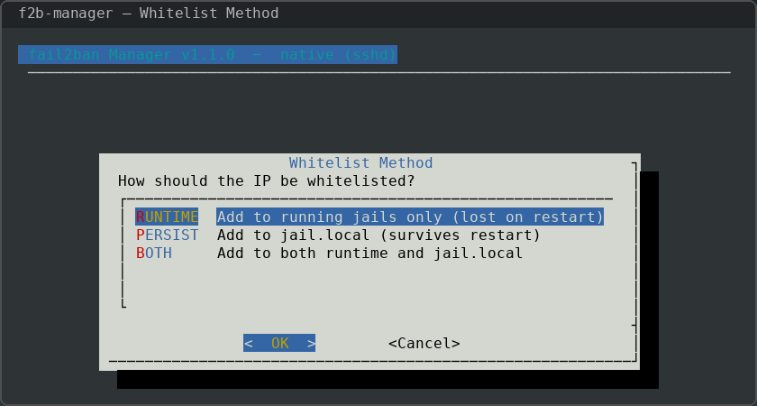
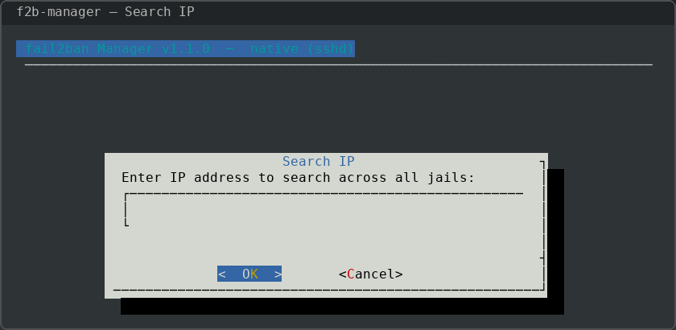
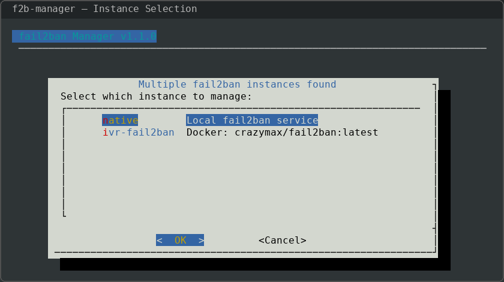

# f2b-manager

An interactive terminal UI (TUI) for managing **fail2ban** bans and whitelists.

Works with both **native** and **Docker-based** fail2ban installations — run it from the host and it auto-detects your setup.

Built with [`dialog`](https://invisible-island.net/dialog/) — no Python, no extra runtimes, just a single bash script.



## Features

- **Auto-detection** — finds fail2ban whether it runs natively or inside Docker (e.g. `crazymax/fail2ban`)
- **Multi-instance** — if multiple fail2ban instances exist (native + Docker, or multiple containers), prompts you to choose
- **Status overview** — see all jails at a glance: currently banned, total banned, failed attempts
- **View banned IPs** — browse banned IPs per jail with option to unban
- **Ban / Unban** — manually ban or unban single or multiple IPs
- **Bulk unban** — unban all IPs from a jail with one action
- **Whitelist management** — view, add, and remove whitelisted (ignored) IPs
- **Flexible whitelisting** — choose runtime-only, persistent (`jail.local`), or both
- **IP search** — search an IP across all jails (banned status, whitelist, log history)
- **Docker volume awareness** — resolves host-mounted `jail.local` for persistent whitelist edits

## Screenshots

### Jail Status Overview

View service status, banned counts, and failed attempts for all jails at a glance.



### Banned IPs

Browse currently banned IPs per jail. Select any IP to unban it directly.



### Bulk Unban

Select multiple IPs to unban at once using the checklist interface.



### Ban an IP

Manually ban an IP address in any jail.



### Whitelist Management

Choose how to whitelist an IP: runtime-only, persistent (written to `jail.local`), or both.



### Search

Search for an IP across all jails — check if it's banned, whitelisted, or appears in logs.



### Docker Instance Selection

When multiple fail2ban instances are detected (native + Docker containers), the tool prompts you to choose which one to manage.



## Requirements

- **Linux** with `bash` 4+
- **fail2ban** — native or running in a Docker container
- **dialog** — TUI framework (`apt install dialog` / `dnf install dialog`)
- **docker** — only needed if fail2ban runs in a container
- **Root access**

## Installation

### One-liner

```bash
curl -fsSL https://raw.githubusercontent.com/gokcer/f2b-manager/main/install.sh | sudo bash
```

### From source

```bash
git clone https://github.com/gokcer/f2b-manager.git
cd f2b-manager
sudo ./install.sh
```

### Manual

```bash
sudo curl -fsSL https://raw.githubusercontent.com/gokcer/f2b-manager/main/f2b-manager -o /usr/local/bin/f2b-manager
sudo chmod +x /usr/local/bin/f2b-manager
```

## Usage

```bash
sudo f2b-manager
```

The script will automatically:
1. Check if fail2ban is running natively on the host
2. Scan Docker containers for fail2ban instances
3. If multiple instances are found, present a selection menu
4. Launch the management TUI connected to the chosen instance

### Docker Compose Example

A typical Docker-based fail2ban setup:

```yaml
services:
  fail2ban:
    image: crazymax/fail2ban:latest
    container_name: my-fail2ban
    restart: unless-stopped
    network_mode: host
    cap_add:
      - NET_ADMIN
      - NET_RAW
    volumes:
      - /var/log:/var/log:ro
      - ./fail2ban/jail.local:/etc/fail2ban/jail.local:ro
      - ./fail2ban/jail.d:/etc/fail2ban/jail.d:ro
```

f2b-manager will detect this container and use `docker exec` to communicate with fail2ban-client inside it. Persistent whitelist edits are written to the host-mounted `jail.local`.

### Menu Options

| Key | Action |
|---|---|
| `STATUS` | Overview of all jails (shows mode: native/docker) |
| `BANNED` | View banned IPs per jail |
| `BAN` | Manually ban an IP |
| `UNBAN` | Unban selected IPs (checklist) |
| `UNBAN_ALL` | Unban all IPs from a jail |
| `WHITELIST` | View whitelisted IPs |
| `WL_ADD` | Add IP to whitelist |
| `WL_REMOVE` | Remove IP from whitelist |
| `SEARCH` | Search IP across all jails + logs |

## How It Works

| Scenario | Detection | Communication |
|---|---|---|
| Native fail2ban | `fail2ban-client status` succeeds | Direct `fail2ban-client` calls |
| Docker fail2ban | Container image/name contains "fail2ban" | `docker exec <container> fail2ban-client ...` |
| Mixed | Both found | User selects via TUI menu |

For persistent whitelist edits in Docker mode, the script inspects container mount points to find the host-side `jail.local` path.

## Uninstall

```bash
sudo ./uninstall.sh
# or simply:
sudo rm /usr/local/bin/f2b-manager
```

## Contributing

Contributions are welcome! Please see [CONTRIBUTING.md](CONTRIBUTING.md) for guidelines.

## License

[MIT](LICENSE)
